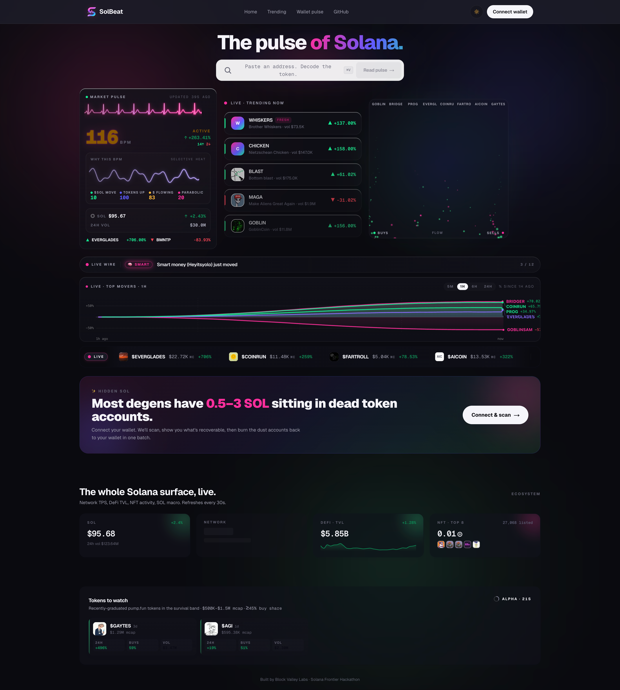
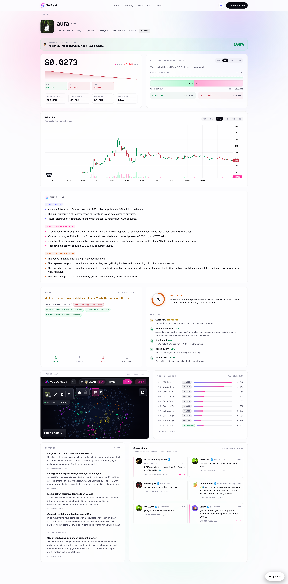
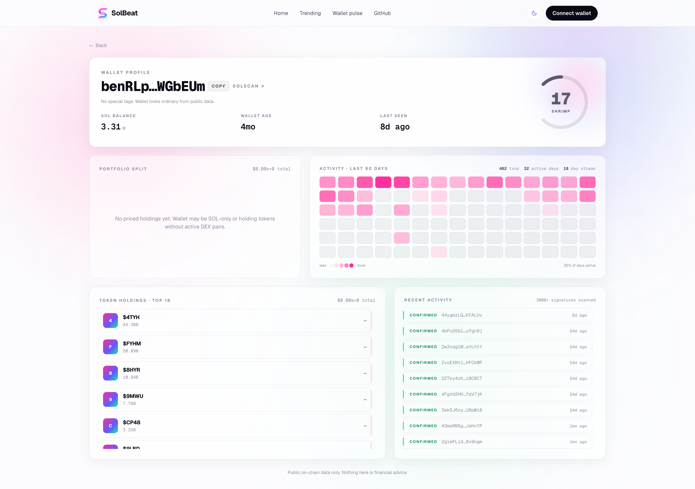

# SolBeat

The pulse of every Solana token, in plain English.


🟢 Live at [solbeat.blockvalley.io](https://solbeat.blockvalley.io)

---

## The 30-second pitch

SolBeat reads any Solana token the way a senior trader would explain it to a friend. Paste a contract address, get a three-paragraph synthesis covering origin, what is happening, and what to watch. The synthesis fuses on-chain data, X sentiment, and live news into one read, so a degen can decide in seconds instead of context-switching across five tools.

DEXScreener shows you 47 numbers. SolBeat tells you what they mean. The AI synthesis is the differentiator. Everything else is plumbing.

---

## Screenshots







---

## Features

🫀 **Token Pulse.** Paste any CA, get a three-paragraph AI synthesis covering what the token is, what is happening right now, and what to watch out for.

💰 **Wallet Pulse.** Connect a wallet, see per-position risk scores, a USD-weighted aggregate risk dial (SAFE / CAUTIOUS / LOADED / DANGER), and smart-money overlap chips that flag when you hold the same tokens as a curated KOL leaderboard.

🔥 **Hidden SOL Reclaim.** Surface SOL locked in empty token accounts and reclaim it in a single transaction.

🔄 **Built-in Swap.** Jupiter v6 routing baked in, no app-switching to trade what you just analyzed.

📡 **Live Catalysts.** Perplexity-sourced news and X sentiment for the last 24 hours, with citations to every claim.

🎯 **Risk Scoring.** Composite 0-100 score with a factor breakdown across liquidity, holder concentration, mint/freeze authorities, age, and volume-quality. Falls back to a pure-TypeScript heuristic when no AI key is set.

---

## Why SolBeat

- **DEXScreener shows you 47 numbers. SolBeat tells you what they mean.**
- **First Solana analytics tool combining on-chain data, X sentiment, and live news in one AI synthesis.**
- **Built for the speed Solana enables: sub-second analysis, cheap reclaims, instant swaps.**
- **Open-core: integration layer is MIT, reasoning layer is proprietary Block Valley IP.**

---

## Tech Stack

| Layer | Tools |
|---|---|
| App | Next.js 16, TypeScript 5, Tailwind v4, shadcn/ui |
| Animation | Three.js, anime.js, framer-motion, D3 |
| Solana | wallet-adapter, Helius RPC, Birdeye, DexScreener, Jupiter v6 |
| AI | Anthropic Claude Haiku 4.5 (with prompt caching), Perplexity Sonar Pro |
| Social | twitterapi.io |
| Caching | Upstash Redis (optional, in-memory fallback) |
| Deploy | Vercel |

---

## Architecture

The data flow for a single token analysis:

```
  User pastes CA
        │
        ▼
  Validation (base58, 32-byte decode)
        │
        ▼
  ┌─────────────── Parallel fetch ──────────────────────────┐
  │  Helius RPC          on-chain metadata + mint state     │
  │  DexScreener         price, liquidity, 5m/1h/24h moves  │
  │  Birdeye             market data enrichment             │
  │  twitterapi.io       recent X posts + engagement        │
  │  Perplexity Sonar    live news + sourced catalysts      │
  └─────────────────────────────────────────────────────────┘
        │
        ▼
  Claude synthesis (3-paragraph read + risk score)
        │
        ▼
  Redis cache (Upstash) or in-memory fallback
        │
        ▼
  Initial render: streamed via React Server Components + Suspense
  (analyzeFast lands above-the-fold first, analyzeSlow streams in behind)
        │
        ▼
  Hydration: client components (PriceCard, BuySellPressure, BondingCurve)
  then poll /api/token/[ca]/quick + /api/token/[ca]/pump for live updates
```

**Graceful degradation contract.** Missing API keys disable their feature, they never crash the build. Helius missing falls back to the public RPC. Birdeye missing falls back to DexScreener. Perplexity missing renders an empty Catalysts panel. Redis missing falls back to a per-process in-memory cache. Anthropic missing falls back to a pure-TypeScript risk heuristic. The site loads and the core flow works even with only Helius configured.

---

## Getting Started

### Prerequisites

- Node 20 or higher
- npm or pnpm

### Setup

```bash
git clone https://github.com/88world/solbeat.git
cd solbeat
npm install
cp .env.example .env.local
# fill in the keys you need, see .env.example for required vs optional
npm run dev
```

Open [http://localhost:3000](http://localhost:3000).

### Environment variables

See [`.env.example`](./.env.example) for the full reference. The file is grouped by purpose (Solana Data, AI, Social, Caching, Fee Accounts, AI Prompts) with `[REQUIRED]` / `[OPTIONAL]` markers on every key and a note explaining what each one does and where to get it.

**The AI system prompts are not included in this repo.** They are proprietary Block Valley reasoning IP. Write your own to match the JSON contract in `lib/ai/prompts/`, or contact [admin@blockvalley.io](mailto:admin@blockvalley.io) for licensing.

---

## Built With

- [Helius](https://helius.dev) for Solana RPC and DAS
- [Birdeye](https://birdeye.so) for market-data enrichment
- [Jupiter](https://jup.ag) for swap routing
- [DexScreener](https://dexscreener.com) for pair data
- [Anthropic Claude](https://anthropic.com) for synthesis and risk reasoning
- [Perplexity](https://perplexity.ai) for live catalysts and citations
- [twitterapi.io](https://twitterapi.io) for X social signal
- [Solana Foundation](https://solana.org) for the chain

---

## What's Next

- **Compare Pulses.** Side-by-side analysis of two or more tokens, with a synthesized "which would you rather hold" verdict.
- **Wallet copy-trade lookup.** Paste a wallet, get an AI summary of its trading thesis derived from public history.
- **Skills marketplace.** Expose SolBeat's analysis as an agent-callable skill for other apps to plug in.
- **Mobile native app.** iOS first.
- **Real-time pulse notifications.** Watchlist a token, get pinged when its pulse meaningfully changes.

---

## License

MIT for the open-source integration code in this repo. See [LICENSE](./LICENSE).

The AI prompts that drive the reasoning layer are proprietary Block Valley Labs IP and are not included. Contact [admin@blockvalley.io](mailto:admin@blockvalley.io) for licensing.

---

## Acknowledgments

Built for the [Solana Frontier Hackathon](https://www.colosseum.org/solana-frontier) by Colosseum.

Shout to the [Solana Foundation](https://solana.org) for an ecosystem that lets you ship something this responsive in a weekend.

---

Built by Kenji at [Block Valley Labs](https://blockvalley.io). Contact: [admin@blockvalley.io](mailto:admin@blockvalley.io)
